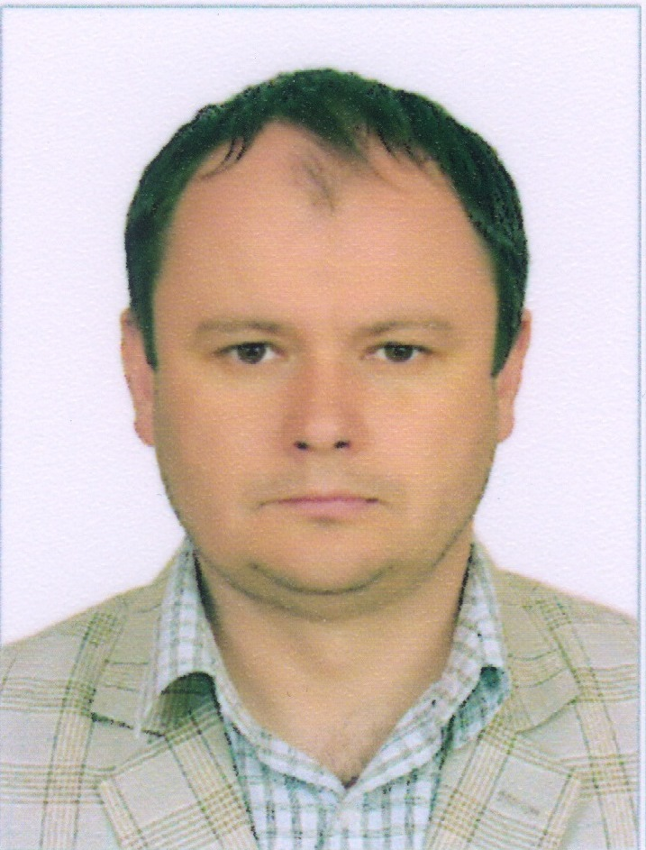

# Мое резюме

## Матофонов Сергей Владимирович.

* Родился в 1981 году в Республике Казахстан.
* Окончил школу в 1999 году.
* 1999-2003 поступил в КарГУ специальность "Математик. Инженер-программист".
* 2005-2007 КЭУ, специальность "Экономика."

## Немного фактов о себе.
* С детсва имею тягу к компьютерам и все что с этим связано. Первый мой компьютер это ZX SPECTRUM появился в 7 классе.
* Писал простенькие программы на языке Basic, начиная с этого периода.
* Когда учился в 10 и 11 классе вел информатику у своих одноклассников и младших классов. Имел неограниченный доступ тогда еще к Pentium I...))
* После окончания школы поступил в университет на профессию инженер-программист,  и начал изучать Pascal, Assembler, но т.к. преподаватели порой учились вместе с нами.
* На третьем курсе, устроился на работу в компьютерную фирму и женился. С тех пор был большой перерыв в IT.
* С прошлого года начал потихонечку для себя изучать Python.
* В этом году прохожу обучение в Netology, надеюсь не все еще упущено...
* Мечтаю вернуться в IT.)